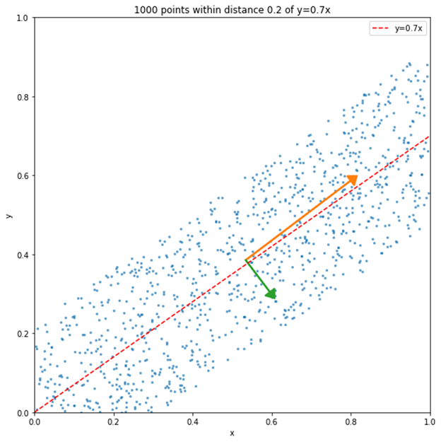
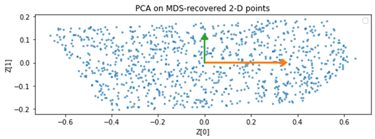
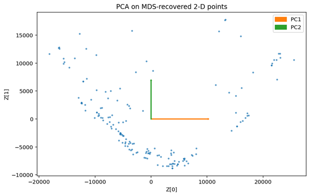

# Why do PCA and Classical MDS produce the same embedding?
## Coordinates and pairwise distances look like fundamentally different descriptions of data. The Gram matrix reveals why they lead to the same geometry.
PCA and Classical MDS start from fundamentally different inputs. PCA operates directly on data coordinates, whereas Classical MDS requires only pairwise distances. At first glance, there is no obvious reason why the two methods should be closely related.

Surprisingly, for Euclidean data, the two methods can recover equivalent embeddings despite these fundamentally different starting points. Is this merely an algebraic coincidence, or does it reflect a deeper geometric connection?

The key is to stop thinking of PCA and Classical MDS as two competing algorithms and instead view coordinates and pairwise distances as two mathematical descriptions of the same underlying Euclidean point configuration.
## Theoretical Relationship Between PCA and Classical MDS
### A Step-by-Step Comparison
As a brief review, PCA starts from a centered data matrix:

$$
X = [x_1, x_2, \ldots, x_m].
$$

The basic procedure is:

$$
X \rightarrow XX^T \rightarrow XX^T W = W\Lambda,
$$

where the columns of $W = [w_1, w_2, \ldots]$ are the principal directions. Multiplying $XX^T$ by the constant factor $1/(m-1)$ simply converts it into the covariance matrix and does not change the eigenvectors.

Classical MDS takes a different route, starting from a pairwise distance matrix $D$. Although some applications appear to begin with coordinates, these coordinates are used only to construct the pairwise distance matrix. With $D$, it first reconstructs the centered Gram matrix $B$ using

$$
b_{ij} = -\frac{1}{2}\left(d_{ij}^2 - d_{i\cdot}^2 - d_{\cdot j}^2 + d_{\cdot\cdot}^2\right).
$$

After eigen-decomposition,

$$
B = V\Lambda V^T,
$$

the reconstructed coordinates are obtained as

$$
Z = \Lambda^{1/2} V^T,
$$

where the number of retained dimensions is chosen according to the desired embedding dimension.
Therefore, the overall procedure of Classical MDS is

$$
D \rightarrow B \rightarrow V\Lambda V^T \rightarrow Z.
$$

### The MDS Solution Is Not Unique
An important observation is that the coordinate matrix reconstructed by Classical MDS is __not__ the unique solution satisfying

$$
B = Z^T Z.
$$

Given the same distance matrix $D$, there are infinitely many coordinate systems that represent exactly the same point configuration. These coordinate systems may differ by orthogonal transformations, embedding dimensions, or other equivalent representations, while preserving the same pairwise distances.

Classical MDS constructs one particular representation through the following steps.

First, transforming

$$
D \rightarrow B
$$

implicitly assumes that the reconstructed coordinates are centered. In other words, the origin is fixed at the centroid of the point configuration.

Second, after obtaining the centered Gram matrix, there are still infinitely many coordinate matrices satisfying

$$
B=Z^TZ,
$$

possibly with different embedding dimensions. Classical MDS selects the embedding dimension specified by the user.

Finally, among all equivalent coordinate systems, Classical MDS adopts the one generated directly from the eigen-decomposition,

$$
Z = \Lambda^{1/2} V^T.
$$

Therefore, Classical MDS should not simply be regarded as a method for recovering a coordinate representation of the point configuration from pairwise distances. Instead, it selects a canonical coordinate system determined by the eigen-decomposition from an infinite family of equivalent embeddings.
### Why Do PCA and Classical MDS Produce the Same Embedding?
The connection between PCA and Classical MDS now becomes clear.

Suppose we perform PCA on the coordinates reconstructed by Classical MDS. Since $Z$ is already centered,

$$
\begin{aligned}
\mathrm{Cov}(Z)
&= \frac{ZZ^T}{m-1} \\
&= \frac{\Lambda^{1/2}V^T V\Lambda^{1/2}}{m-1} \\
&= \frac{\Lambda}{m-1},
\end{aligned}
$$

which is already diagonal.

Therefore, no further rotation is required—the coordinates reconstructed by Classical MDS are already expressed in the principal-coordinate system.

Now consider another valid reconstruction,

$$
Z' = Q\Lambda^{1/2}V^T,
$$

where $Q$ is an arbitrary orthogonal matrix.

This alternative reconstruction produces exactly the same pairwise distance matrix because

```math
\frac{Z^{\prime}(Z^{\prime})^T}{m-1}
=
\frac{Q\Lambda Q^T}{m-1}
```

which differs only by an orthogonal transformation.

This explains why the distance matrix admits infinitely many coordinate representations of the point configuration, while Classical MDS chooses the canonical one obtained directly from eigen-decomposition. That canonical representation coincides with the coordinate system produced by PCA.

### Underlying Principles
The mathematical derivation explains __how__ Classical MDS and PCA produce the same embedding. A more fundamental question is __why__ this happens. Why does the canonical embedding selected by Classical MDS coincide with the PCA coordinate system?

The objective of PCA is well known: among all $d^{\prime}<d$-dimensional linear subspaces, it seeks the one that maximizes the total variance of the projected data.

What, then, is the corresponding objective of Classical MDS?

Starting from

```math
B=Z^TZ,
```

consider the quadratic form

```math
c^T Z^T Z c = \lVert Zc \rVert^2,
```

where $c$ satisfies

```math
c^Tc=1.
```

The vector $Z$ crepresents a direction in the reconstructed coordinate system, and its squared Euclidean norm measures the energy along that direction.

Consequently, the solution adopted by Classical MDS is exactly the optimizer of

```math
\arg\max_c \; c^T Z^T Z c,
```

subject to

```math
c^Tc=1.
```

More generally, if we seek a $d^{\prime}$-dimensional subspace, the optimization becomes

```math
\arg\max_C \; \mathrm{Tr}\left(C^T Z^T Z C\right),
```

subject to

```math
C^TC=I.
```

Applying the method of Lagrange multipliers yields

```math
Z^T Z C = C\Lambda.
```

Therefore, Classical MDS can be interpreted as searching for the set of directions that maximizes the total energy of the point configuration under the Euclidean-distance constraint.

This immediately explains the equivalence with PCA. Formally, the matrices $ZZ^T$ and $Z^TZ$ generally have different dimensions and different eigenvectors, but they share exactly the same nonzero eigenvalues, and their eigenvectors are related through the singular vectors of $Z$. Conceptually, PCA and Classical MDS solve the same optimization problem from different mathematical formulations. PCA maximizes the covariance of the projected data, whereas Classical MDS maximizes the energy of the reconstructed point configuration. For centered Euclidean data, these two objectives are equivalent. Therefore, both methods ultimately solve the same spectral problem and recover equivalent embeddings.

## Experimental Results on a Toy Dataset
To verify the theoretical analysis, we first construct a simple two-dimensional toy dataset. A total of 1,000 random points are generated within the unit square, with the additional constraint that each point lies within a distance of 0.2 from the line $y=0.7x$. Consequently, the data approximately lie on a one-dimensional manifold embedded in a two-dimensional space. The original dataset is shown in Figure 1.



To make the comparison more intuitive, we first perform PCA on the original coordinates. The resulting principal components are illustrated in Figure 1. The corresponding eigenvalues are

```math
\lambda_1 = 110.7,\quad \lambda_2 = 10.26.
```

These values will be compared with those obtained from Classical MDS later.

Next, we compute the pairwise Euclidean distance matrix from the same dataset and apply Classical MDS. The reconstructed embedding is shown in Figure 2.



Visually, the embeddings produced by PCA and Classical MDS are almost indistinguishable. As expected from the theoretical analysis, the two methods recover the same principal-coordinate representation, differing only by possible sign changes or other orthogonal transformations, which do not alter the underlying geometry of the point configuration.

To further verify the equivalence, we compare the eigenvalues obtained from both methods. The eigenvalues recovered by Classical MDS are

```math
\lambda_1 = 110.7,\quad \lambda_2 = 10.26.
```

which are identical to those obtained from PCA, up to numerical precision. This agrees exactly with the theoretical result that the nonzero eigenvalues of $ZZ^T$ and $Z^TZ$ are the same.

Finally, we compare the principal directions recovered by the two methods. As predicted, the directions coincide up to an orthogonal transformation (or, in this two-dimensional example, a possible sign flip). This confirms that PCA and Classical MDS recover the same principal-coordinate system from two different mathematical descriptions of the same Euclidean point configuration.

## Experimental Results on the Yale Face Dataset
To further validate the theoretical analysis, we next consider a real-world dataset. The Yale Face Database is a standard benchmark in pattern recognition and dimensionality reduction. Unlike the toy example, this dataset consists of high-dimensional face images with variations in facial expression and illumination, providing a more realistic evaluation of the proposed analysis.


Each image is first reshaped into a vector, and the resulting data matrix is centered before applying PCA. The first two principal components are used for visualization, and the resulting embedding is shown in Figure 4.



Using the same dataset, we then compute the pairwise Euclidean distance matrix and apply Classical MDS with the same embedding dimension, and we can obtain exactly the same embedding as in Figure 4.

Despite starting from entirely different mathematical descriptions—coordinates for PCA and pairwise distances for Classical MDS—the two embeddings exhibit almost identical geometric structures. Images corresponding to similar facial expressions and lighting conditions remain close to one another in both embeddings, while images with larger appearance differences are consistently placed farther apart.

To further quantify the agreement, we compare the eigenvalues obtained from the two methods. The first three nonzero eigenvalues recovered by Classical MDS match those obtained from PCA to numerical precision, providing additional evidence that both methods solve the same underlying spectral problem.

```math
\lambda_1 = 1.71 \times 10^{10},\quad
\lambda_2 = 7.90 \times 10^9,\quad
\lambda_3 = 4.99 \times 10^9.
```

Overall, the Yale Face experiment demonstrates that the theoretical relationship derived in the previous section is not restricted to simple synthetic data. It remains valid for realistic high-dimensional datasets, where PCA and Classical MDS continue to recover equivalent principal-coordinate representations from two different mathematical descriptions of the same Euclidean point configuration.

## Discussion
The theoretical derivation and experimental results establish that PCA and Classical MDS produce equivalent embeddings for centered Euclidean data. However, the significance of this equivalence extends beyond the mathematical proof itself. More importantly, it provides a unified perspective on how these two seemingly different methods should be understood.

PCA and Classical MDS are often introduced as two independent dimensionality reduction algorithms. PCA starts from data coordinates, whereas Classical MDS starts from pairwise distances. From an algorithmic point of view, they appear to solve different problems. A more unified view, however, is to regard them as two computational routes to the same centered Euclidean point configuration.

The key observation is that coordinates and pairwise distances are not competing descriptions of the data. Instead, they are two different mathematical descriptions of the same underlying Euclidean point configuration. Coordinates explicitly specify the location of each point in a coordinate system, whereas pairwise distances describe only the geometric relationships among the points. Although these descriptions contain different forms of information, they characterize the same underlying geometry.

The centered Gram matrix serves as the bridge between these two descriptions. PCA reaches the Gram matrix directly from the coordinates, while Classical MDS reconstructs it from pairwise distances through double centering. Once the centered Euclidean point configuration has been encoded in the Gram matrix, both methods reduce to the same eigen-decomposition problem and therefore recover the same principal-coordinate representation. We can use the following figure to describe the concept relations.


This unified viewpoint also clarifies the scope of the equivalence. The discussion throughout this article applies specifically to __Classical MDS__ under __Euclidean distances__. If the dissimilarities are non-Euclidean, the double-centered matrix is no longer guaranteed to represent an exact Euclidean point configuration. Likewise, metric and non-metric MDS optimize different objective functions and therefore are not expected to be equivalent to PCA in general.

More broadly, this perspective suggests that many dimensionality reduction algorithms differ primarily in __how the geometric structure of the data is represented__, rather than in __what geometric structure they ultimately seek to recover__. In the case of PCA and Classical MDS, the mathematical descriptions are different, but the underlying geometry—and consequently the recovered principal-coordinate representation—is the same.

## Summary
PCA and Classical MDS appear to start from different mathematical descriptions, yet they ultimately recover equivalent principal-coordinate embeddings for centered Euclidean data.

This equivalence is not an algebraic coincidence. It reflects the fact that coordinates and pairwise distances describe the same underlying Euclidean point configuration from different perspectives.

__Different mathematical descriptions, the same underlying geometry.__
